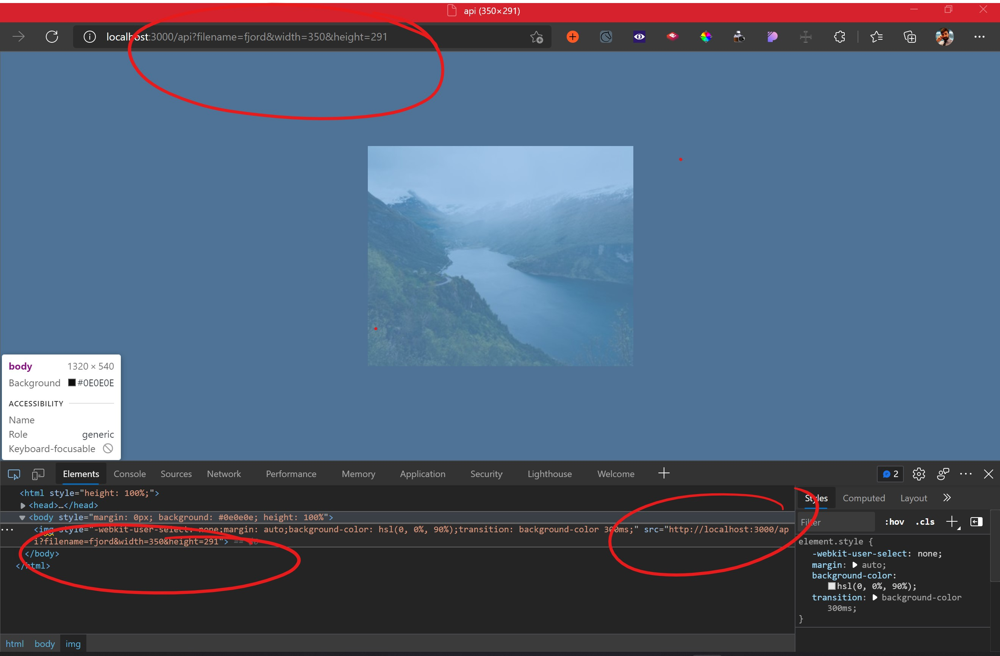

<h1 align="center">Image Processing API</h1>

 The main functions of this project are: 

1: To provide a fast reliable image resizing without needing to upload extra variations of the same image via a URL query 
2: Allow for the usage of the URL as placeholder in code (such as inside and img.src) without needing to upload the image in the needed sizes and formats

## Links

- [Repo](https://github.com/Jriera/IP-API" "Repo")

- [Bugs](https://github.com/Jriera/IP-API/issues "Issues Page")

## Screenshots

## Available Commands

In the project directory, you can run:

### `npm run start"

The command will run 'node index.js which will start the express app on localhost:3000. Open [http://localhost:3000/api](http://localhost:3000/api) and append the query with the image filename and dimensions needed. for instance
http://localhost:3000/api?filename=fjord&width=350&height=291. To get the image fjord in the size of 350x291

### `"npm run build"

Builds the app for production to the `dist` folder. It correctly transpiles all the dev code in .ts to working javascript files

### `"npm run test"

Launches a build and jasmine to run the tests

### `"npm run nodemon"

For running the developement version of the app

## Built With

- TypeScript
- Express
- Node
- Jasmine
- NPM
- HTML
- CSS

## Future Updates

- [ ] Allow for file upload

## Author

**Jordi Riera**

- [Profile](https://github.com/Jriera "Jordi Riera")
